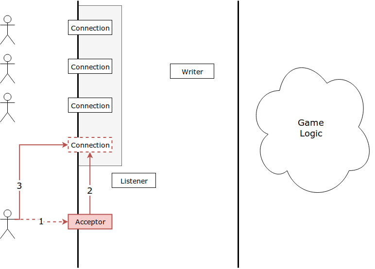

# Connector

## Architecture

### Overview

The connector is a part of the Gateway server responsible for handling user connections and passing information between them and the game logic.

The elements of the connector are:

  * **Acceptor**
  * **Listener**
  * **Writer**
  * a list of **Connections**

Each user must first connect to the acceptor, which will create a connection object in the list of all connections. Whenever the user sends any data to the server, the listener will fetch it and send it to the queue inside the game logic; whenever the game logic decides to send anything to the user, it will send a message to the writer, which, in turn, will send the message through the respective connection.

### Connection

A connection is a wrapper around a socket object, providing methods for sending and receiving Lisp data. This Lisp data may contain lists, uninterned symbols, strings, and numbers. It should also have a method for retrieving the socket object, while this socket object should also have a method for retrieving its associated connection object.

### Acceptor

The acceptor's role is to accept the incoming connection from the user, create the connection object and insert it into the connection list. The communication will then happen through the created connection object.

After inserting the new connection, the acceptor also needs to notify the listener that the connection list has been modified, so the listener may take it into account when listening for input.

### Listener

The listener is responsible for waiting for input on the connection objects and passing it to the game logic each time a connection responds with valid Lisp data by means of calling a single callback function with the received message and the connection the message came from as that function's arguments.

The listener should have a notification method, through which it can be notified of a change inside the connection list. It should also handle connection errors, closing connections and removing them from the connection list if appropriate, and calling the writer in case the connection needs to be notified that it has sent malformed input.

### Writer

The writer is responsible for writing data to connections. It is invoked by the game logic (or, in special situations, by the listener) whenever data needs to be sent to the client by invoking the writer's write method, passing the connection and the message as arguments.

The writer is the only object in the connector allowed to write data to connections to avoid race conditions on output.
