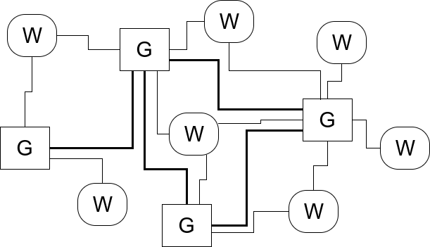
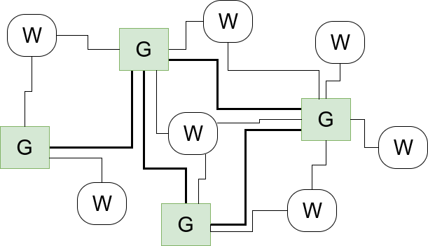
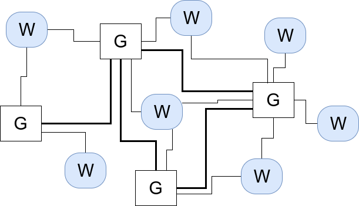
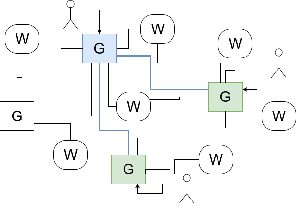
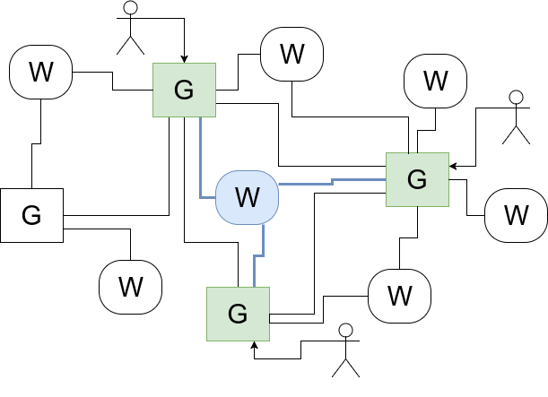
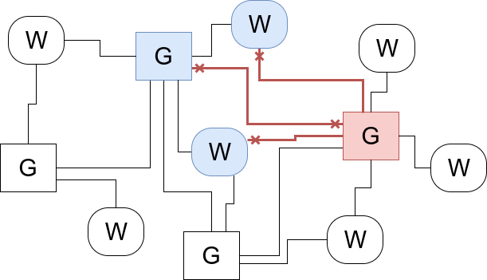
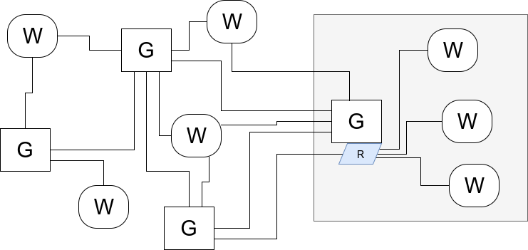

# Gateway basics

## Architecture

### Network



The whole game network consists of gateways (G) and worlds (W). Gateways may be connected to any number of other gateways and worlds, where worlds can only be connected to gateways. *(If we ever decide to do inter-world functionality, this may change, but for now, let's keep it simple.)*

The set of connections can, and will, change over time. New connections can be made, and dead and/or unnecessary connections can be dropped, and possibly reestablished later.

### Gateways



Gateways are the entry points to the network and homes of user accounts. Each gateway is responsible for handling user connections, authenticating them, and routing user connections to individual worlds. Additionally, gateways store and replicate data for textual roleplays.

### Worlds



Worlds represent user-creatable maps that user characters can play on, explore, et cetera. Such worlds can be scripted for interactivity and timed events and offer in-world chats. Each world accepts user connections via gateways.

Each world is responsible for storing information required for its internal functioning with respect for user characters, not user accounts. Handling accounts is the responsibility of gateways.

### Access - roleplay



A roleplay session is assigned to a single gateway that acts as that session's home.

When three users from different gateways want to roleplay, their gateways connect to the home gateway (blue) and all user actions are forwarded to that gateway. The home gateway then notifies the replicating gateways (green) of any changes in the roleplay, so the copies stored on the gateways are in sync with the primary, version stored on home. The replicating gateways then notify their users of the changes.

### Access - worlds



When a user wants to access a world, their gateway connects to that world and routes all user traffic to it. This way, users from different gateways can connect to a world at once and interact with each other there.

The systems for world access and roleplay are decoupled from each other, so users who are only interested in worldbuilding and users who are only interested in roleplaying do not have to use the functionalities they are not interested in.

**TODO** Are we really sure about it? Why not use some form of user authentication between gateways and worlds? A gateway can sign a one-time cookie provided by the world to the user to verify that it allows that user to enter the world, and the world can verify the gateway's signature on that to verify the user. This approach puts less network stress on gateways, as worlds may be very bandwidth-intensive in case of highly dynamic scripts and content.

### Blocking



A part of the network may block another part of the network from accessing it. For instance, the worlds and gateways marked blue can block access from/to the gateway marked red.

Note that the blocks are local to these gateways and worlds only, and other parts of the network can still connect to the red instance unless they block it on their own.

### Clustering



It is possible *(actually, it's expected!)* that a single server will host a gateway along with multiple worlds. In that case, the worlds will be accessible through a simple router embedded in the gateway that will route traffic between users and the respective worlds.

## Goals

  * We have user accounts.
  * We have characters that are linked to user accounts. A character has its owner account and also some borrower accounts who can write posts "as" that character.
  * We have RP timelines that contain chapters.
  * We have RP chapters that contain posts. Chapters can be linked to one another in a before/after relationship.
  * We have RP posts that are organized chronologically inside chapters. Each post is authored by a combination of account and character.
  * We have a permission system that says which accounts can view/edit/link/post as which chapters/timelines/characters and so on.

## Protocol

### Server-client

Initially, a custom protocol will be used, based on Lisp S-expressions. *(Once the base features are complete, we will move to using ActivityPub over WebSockets.)*

The protocol is message-based. The available types inside a message are:
  * Symbols, in form `FOO BAR BAZ`, case-insensitive and automatically upcased when read,
  * Strings, in form `"foobarbaz"` with `"` and `\` characters escaped via `\`,
  * Integers, in standard decimal form,
  * Floats, period separated or in form `1.23f4`,
  * Doubles, in form `1.23d4`,
  * Lists, in form `(element-1 element-2 element-3 ...)`, able to contain all other types, including nested lists.

Each message must be a list.

The first element of a message is a numerical ID of the message. The second element of a message is a symbol that denotes the type of the whole message. For example, `(1 LOGIN ...)` sent by a client is a login request, to which the server may respond with `(1 OK ...)` or `(1 ERROR ...)`.

Each message is either a request or a response.
  * The server is allowed to only create requests with even IDs where the client must only send messages with odd IDs. This means that the server-sent IDs start may start from `0` and then go on like `2, 4, 6, ...` where the client may start from `1` and then go on like `3, 5, 7, ...`.
  * A response is allowed to have any ID. Its symbol must be either `OK` or `ERROR`. The body of the `OK` response, if present, should contain the response result, and the body of an `ERROR` response must always contain the details of the error that happened.

An example session following this protocol is below. `S>` denotes a line sent by the server and `C>` denotes a line sent by the client. *(Please note that this is only the example of the syntax - the format and contents of the message bodies may not be understood by the Gateway software. Please refer to the documents describing the message contents, as soon as they become written, that is.)*

```common-lisp
S> (0 HELLO "Gateway v.0.1234" "raptor.systems")
C> (0 OK)

C> (1 LOGIN "aza@raptor.systems" "StopUsingRaptorsAsPasswords")
S> (1 OK)

C> (3 SHOW CHARACTERS)
S> (3 OK ((CHARACTER "Aza d'Orano" FEMALE ...)
          (CHARACTER "Not Aza" FEMALE ...)
          (CHARACTER "Also Not Aza" MALE ...)))

C> (5 SHOW CHARACTER "Absolutely Not Aza")
S> (5 ERROR (NO-SUCH-CHARACTER "Absolutely Not Aza"))

S> (2 NEW-MESSAGE (MESSAGE (CHARACTER "Sebastian")
                           (CHARACTER "Aza d'Orano")
                           (DATE "2018-07-15T20:21:18Z")
                           "Hello! How are you doing?"))
C> (2 OK)

...
```

### Server-server

Once the base features are complete, federation via ActivityPub will be added.

## Glossary

* **Gateway**
  * The general name for this decentralized roleplaying project.
  * A server inside the network responsible for authenticating players, connecting to worlds and storing roleplay sessions.
* **World**
  * A server inside the network housing a single world that player characters can connect to, explore and interact with.
* **Network**
  * The collection of interconnected gateways and worlds serving the players.
* **Player**
  * A human user of the network.
* **Account**
  * A basic unit identifying a player on an instance and inside the network.
* **Owner account**
  * An account that owns a character.
* **Borrower account**
  * An account that is permitted by the owner account to roleplay as a borrowed character.
* **Character**
  * An entity representing a roleplayable character. Each character has an owner account assigned to it and may additionally have a number of borrower accounts.
* **Post**
  * A smallest self-contained unit of textual roleplay, authored by a combination of an account and a character.
* **Chapter**
  * A collection of posts in a linear, chronological order.
* **Timeline**
  * A collection of chapters connected via links.
* **Link**
  * A chronological connection between two chapters.
* **Permission**
  * An entry in the gateway system describing the ability of an account or character to perform an action on the system.
